# ProductCommunity - Product Reveiw Platform

## 📝 Description
Product community is a web application that provides:
- Role based user authentication and authorization
- Adding Product Review
- Requesting for Product Review if no product review is available
- Admin dashboard for management
- Adding Product
- Approving or Rejecting the peding reviews

## ✨ Key Features

### 🔐 Authentication System
- JWT-based secure authentication
- google OAuth authentication for sign-in/sign-up
- Email verification for new registrations
- Password reset functionality
- Role-based access control (User/Admin)

### 🛍️ Product-Community Features
- Product browsing with reviews
- Posting Product reviews
- Requesting for product reviews
- Product Review Requests history

### ⚙️ Admin Dashboard
- Add Product
- Approve or Reject the user pending reviews

## 🛠️ Tech Stack

### Backend
- **Framework**: Spring Boot 3.5
- **Security**: Spring Security + JWT + OAuth2.0
- **Database**: MySQL 8.0
- **API Documentation**: OpenAPI 3.0 (Swagger)
- **Build Tool**: Maven
- **Unit Testing**: Junit5 & Mockito

### Frontend
- **Framework**: Angular 19
- **UI Components**: Angular Material
- **State Management**: NgRx
- **Styling**: Bootstrap 5 + SCSS

## 🚀 Getting Started

### Prerequisites
- Java 17+
- Node.js 18+
- Angular CLI 19
- MySQL 8.0+

## 📸 Screenshots

### Project Homepage
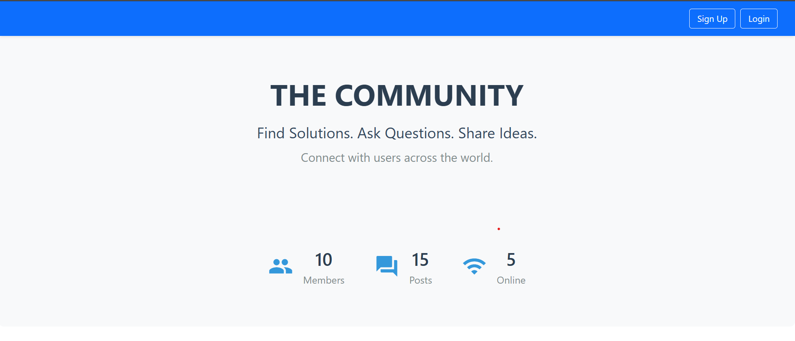

### Authentication Flow
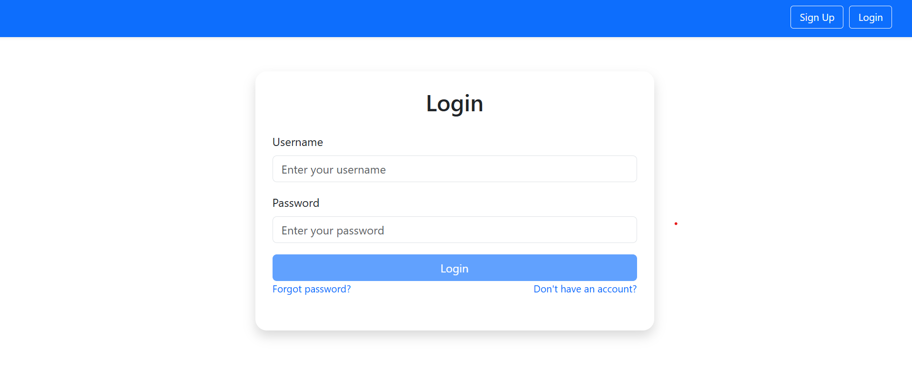  
*User login interface*

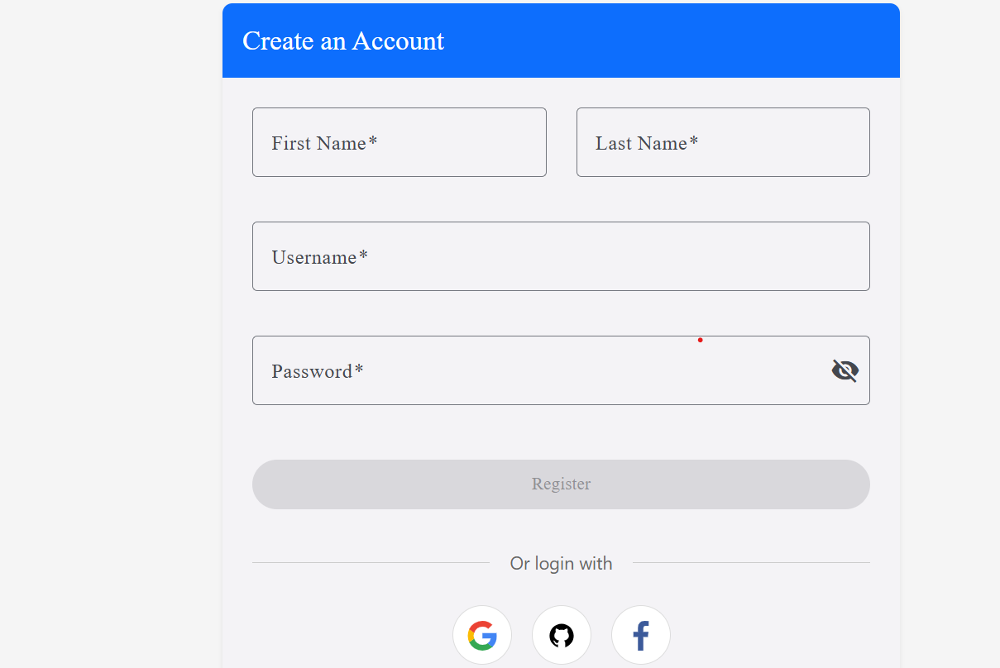  
*New user registration form*

### Product Management
| Admin View | User View |
|------------|-----------|
| 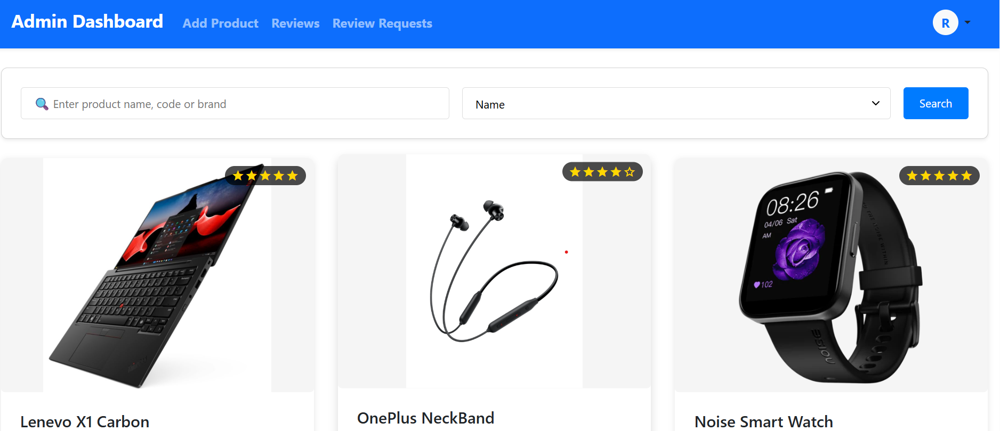 | 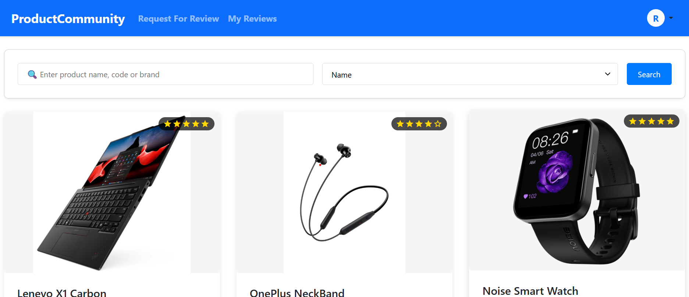 |

### User Review Comment Post
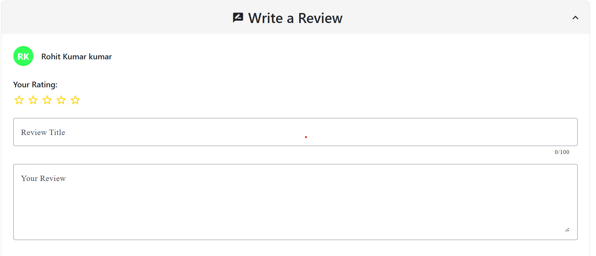

### Product All Reveiws
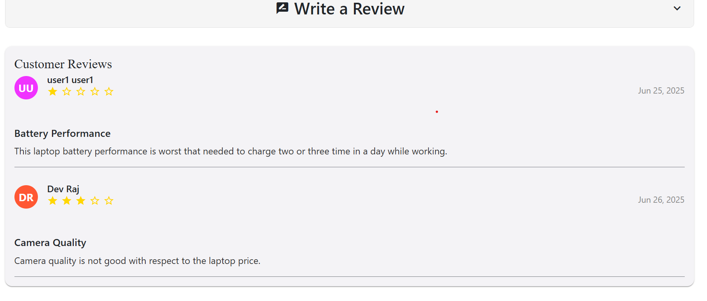

### User Product Reveiw Request
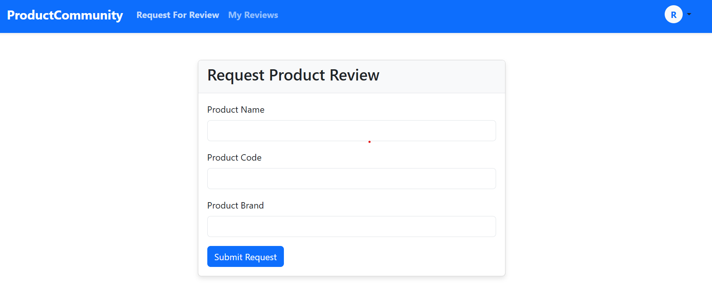

### Admin Product Add Page
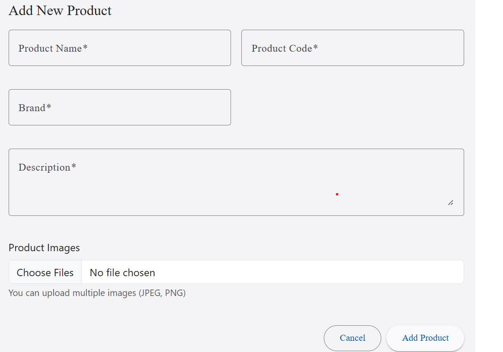

### Admin All Reviews Page
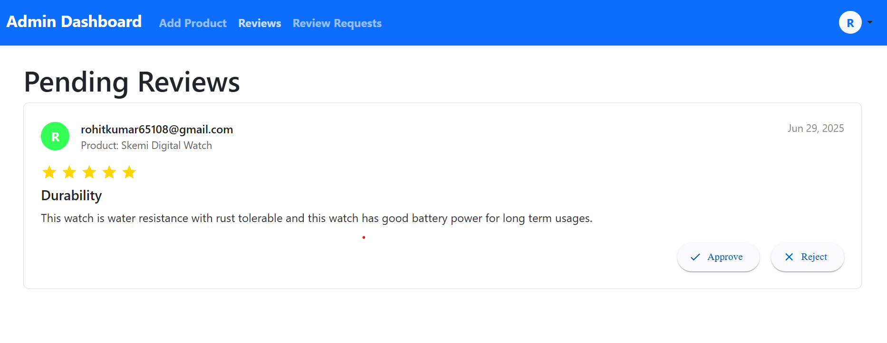

### Admin All Product Reviews Request Page
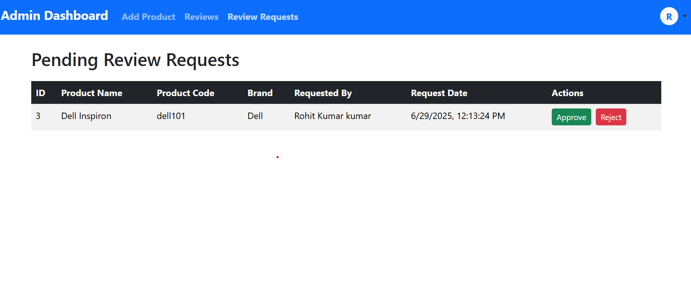